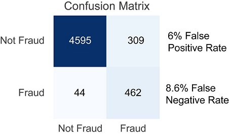
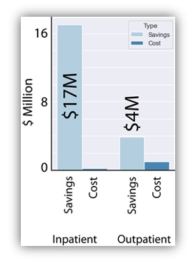

# Data Science Capstone Project: Predicting Healthcare Fraud

According to the CDC, the United States spends over 3 trillion dollars per year on healthcare. At this scale, even minor inefficiencies can be costly. The National Health Care Anti-Fraud association estimates that at least 3% of spending is lost due to fraud, amounting to more than $68 billion in unnecessary costs per year. These costs are passed on the the customer. On an individual basis, American citizens paid an avearge of $11,172 in healthcare related expenses in 2018, indicating a loss of $330 per person, per year. As such, fraud detection is a major concern.

## Project Overview

For my capstone project, I used machine learning to identify Medicare fraud using the Kaggle Healthcare Provider Fraud Detection Analysis dataset. The dataset includes multiple documents including 138k anonymized patient profiles, along with 40k inpatient and 500k claims records. Each provider is given a binary classification indicating if the institution was suspected of having committed fraud. My goal was to develop a high efficiency model for detecting new instances of fraud that minimizes the rate of false negatives.

## EDA

Exploratory data analysis demonstrates that 9% of outpatient service providers are suspected of having committed Medicare fraud. For inpatient services, the problem is far worse (red): roughly 20% of providers are suspected of fraud.

Unlike the previous data sets we examined which were essentially single flat files, the Medicare fraud data is essentially a relational database. Each provider serviced many patients. As a result, I had to engineer a variety of new features to distill various patterns into a into a single data field - one per provider. 

As such, it was important to test variety of calculations. I first looked at the distribution of treatment costs per patient, with the expectation that fraudulent providers might overcharge. Indeed, I found that the providers suspected of fraud had a higher mean, as well as several outlier charges in the outpatient group that exceed the highest values in the non-fraudulent provider group.

I also found that the number of inpatient (left graph) and out patient (right graph) readmissions directly correlated with fraud (possibly fraudulent providers are in orange, non-suspected providers in blue), consistent with the idea that fraudulent providers might unnecessarily re-admit their patients.

Interestingly, the incidence of readmittance scaled linearly with the overall number of patients, which seemed to suggest that re-admission was not a relevant predictor or fraud. However, once the number of patients exceeds a certain threshold, it becomes almost certain that fraud will occur (demonstrated below using a SVM model). This could potentially be due to high throughput providers anticipating that fraudulent charges will not be discovered given their large volume of claims. Irrespective of the reason, it seemed that these features should all be useful predictors.

I also engineered several other fields including the type and frequency of chronic illnesses being treated, race, gender, and duration of hospital stay. All told, there were 39 fields that were initially used to train the models.

## Model testing

I initially tested a support vector machine model, and conducted a grid search using linear, polynomial, or rbf kernel, and a range of penalty parameters. This demonstrated that a rather hard margin (C = 1000) was sufficient for category segregation, indicating that the fraudulent and non-fraudulent groups could be clearly separated for most predictors. In this example, repeated from above, the number of patients (x-axis) and hospital readmissions (y-axis) are strong predictors of fraud with a clear cutoff around the 100 patient cutoff.

Ultimately, the SVM training and test scores were both closely correlated demonstrating a lack of overfitting, and a reasonable accuracy with model score of 0.936 and 0.930, respectively. However, despite the high model score values, a confusion matrix showed that the minority class (Fraud) was only detected at 68% efficiency.

To see if I could build a better model using a different method, I trained a gradient boosting model. Even before optimization, the XGB model yielded a better fit with model score values of 0.980 for the training data and 0.946 for the test data.

However, despite the high model score, a confusion matrix showed that the minority class (Fraud) was only detected at 68% efficiency.

The low efficiency of the initial model is likely due to the low relative abundance of the Fraud class, suggesting that oversampling should be used to balance the training data. Accordingly, I used SMOTE to resample the data, then retrained the model. While SMOTE didn’t improve the model score value of the model, it reduced the false negative rate by a remarkable 73%. Under this model, over 90% of fraudulent charges can be accurately identified.

An examination of the new model using feature importance scoring showed that some feature columns may be adding noise without actually improving the model. 

As such, I tested how the removal of individual features affected the model score and false negative rate. (See below. For reference, the full data frame is indicated by the red box/arrow.)

In particular, removing information regarding outpatient claims lacking a listed physician improved the false negative rate by half a percent. After that improvement, the model was essentially optimized as further feature removal only increased the rate of false positives and false negatives. Using the optimized data and model, only 12-16 features are of primary importance - in particular patients with extremely long hospital stays. Yet the low importance features were still necessary for reducing false negative calls, offering insight into the key identifiers of fraud. These features could be further investigated for more information.

## Conclusions

The identification of over 90% of likely-fraudulent charges should provide a substantial savings for insurers, and by extension, customers. In this dataset, the average claim is $9605 for inpatient procedures among the providers suspected of fraud but only $3363 for non suspicious providers. Likewise, charges are $473 and $262 respectively, for outpatient procedures. Assuming that an investigation takes 5 hours of work by a single investigator making $20/hour, the cost is roughly $100 per investigation. Given the potentially low cost of an investigation and the high cost of fraud, insurers are highly incentivized to conduct investigations, especially for inpatient cases.

Fraudulent providers also tend to submit 29.5% more claims than non-fraudulent counterparts (20,623 versus 15,993, respectively). As there are relatively fewer fraudulent providers (506) relative to the non-fraudulent providers (4904), the claims per provider is 12 times higher for suspicious provider group (40.7 cases/fraudulent provider divided by 3.26). Using the assumption that 10% of the fraudulent provider’s claims are spurious, there are 2063 cases of fraud documented here, amounting to roughly $20M per year (2063 cases * $9,605/case). By extension, applying the XGB model to detect fraud at 90% efficacy should result in a savings of $17M/year minus the cost of the investigation (2063 * $100 = $206k) which is comparatively insignificant. Even in the case of inpatient investigations where the savings per case is lower, the increased number of cases (104k) indicates a potential net savings of $3.9M after the total savings of $4.9M (10% of 104k cases * $473/case) and investigation costs of $1M.

## Major insights

My modeling suggest that insurers can fight insurance fraud by closely monitoring:

- cases of extended or repeated hospital stays
- treatment of certain chronic illnesses
- monthly total billing that exceeds threshold values
- providers with excessive patient throughput
- individuals who receive unusually high medical bills

